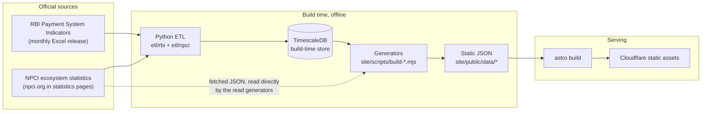
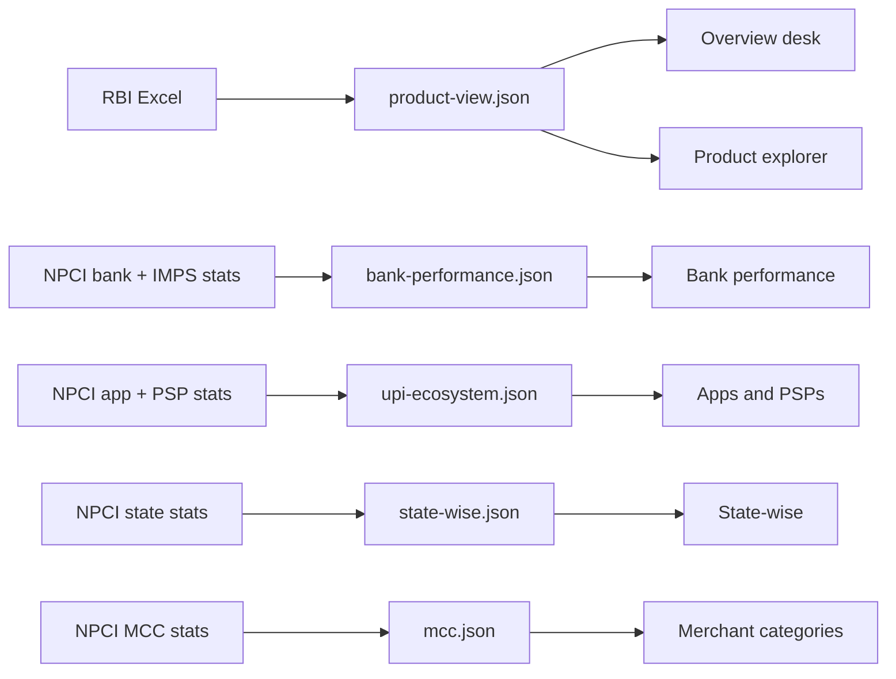
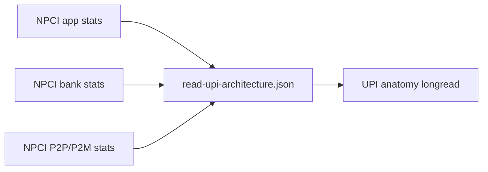
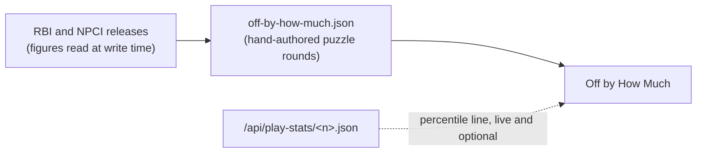

# How the data flows

Where every number on Time Series of India comes from, how it is transformed on
the way, and exactly what the site's two live feeds store. This is the
reference behind the short version on [/data](https://timeseriesofindia.com/data);
it also serves as the privacy disclosure for the game beacon and /meta.

## The shape of the site

The published site is fully static. Everything below the "build" line runs on a
maintainer machine before a deploy; there is no database or application server
behind the pages you load.



NPCI figures are fetched from the same endpoint NPCI's own statistics pages
load their data from, at a low cadence matched to the monthly releases; if the
endpoint declines a request, the fallback is the statistics pages themselves.

Datasets are content-hashed, so `/data/*` files are immutable once published;
a page and the numbers it was built against always travel together.

## Source to page

Which source feeds each surface:

| Surface | Source | Build path |
|---|---|---|
| Overview desk, Product explorer | RBI Payment System Indicators | `etl/rbi` → `payment_statistics` → `build-dashboard-data.mjs` → `product-view.json` |
| Bank performance desk | NPCI UPI remitter/beneficiary + IMPS bank stats | `etl/npci` → `upi_bank_statistics`, `imps_bank_performance` → `build-dashboard-data.mjs` → `bank-performance.json` |
| Apps & PSPs desk | NPCI UPI app + PSP stats | `etl/npci` → `upi_app_statistics`, `upi_psp_statistics` → `build-dashboard-data.mjs` → `upi-ecosystem.json` |
| State-wise desk | NPCI state-wise stats | `etl/npci` → `upi_statewise_statistics` → `build-dashboard-data.mjs` → `state-wise.json` |
| Merchant categories desk | NPCI merchant-category (MCC) stats | fetched NPCI JSON → `build-reads-data.mjs` → `mcc.json` |
| Short reads (retired, unlisted) | NPCI app, bank, P2P/P2M and MCC stats | fetched NPCI JSON → `build-reads-data.mjs` → `reads/*.json` |
| UPI anatomy longread | NPCI app, bank and P2P/P2M stats | fetched NPCI JSON → `build-read-upi-architecture.mjs` |
| Off by How Much (game) | RBI and NPCI figures | hand-authored puzzle JSON, figures taken from the releases at write time |
| /meta | Cloudflare analytics for this site | baked `traffic.json` snapshot, refreshed live (see below) |

### Explore (the dashboard desks)



### Read



The retired short-form reads keep their pages and datasets (`reads/*.json`,
built from the same fetched NPCI JSON); they are unlisted from the shelf but
stay live as link targets from the game and decks.

### Play



## How the numbers are handled

Figures come from the releases as published. The pipeline applies a small,
fixed set of preparations before charting:

- **Unit conversion for display.** NPCI publishes volumes in millions; the site
  charts them in crore. RBI values appear as ₹ crore or ₹ lakh crore depending
  on the panel. Conversions are arithmetic only.
- **Variant combining.** Where a source publishes one instrument split across
  rows (for example RBI's Credit Card PoS and e-commerce variants), the rows
  are combined when the release itself treats them as one product.
- **Name unification.** Source files spell the same entity differently across
  months. Bank names are grouped through one shared canonical map used by both
  the database and the read pipeline. Merchant categories are keyed by NPCI's
  own MCC code, because the text labels drift (the same category has appeared
  with different casing, padding, and even a different name in different
  months). App names with spelling variants are merged the same way.
- **Values are never changed.** Only labels are unified and units converted.
  Where a chart and the official release disagree, the release is correct;
  please [report it](https://github.com/time-series-of-india/tsoi/issues).

## Live feeds, and what they store

Two small scheduled Cloudflare Workers exist outside the static build. The
site never depends on either of them: if they are down, /meta falls back to
its baked snapshot and the game's percentile line simply does not render.

### `/data/live/traffic.json` (feeds /meta)

A worker merges this site's own Cloudflare analytics into one aggregate file
every five minutes. The file contains, and the feed stores, only aggregates:

- daily visitors, page views and requests
- page views per hour
- daily page loads from real browsers (Cloudflare Web Analytics' in-page
  beacon, the "Humans" view on /meta; ad blockers commonly block it, which is
  expected)
- visits per country per day, and referrer hosts per day
- dispatch markers (release id, date, label)

There are no per-visitor records in the feed; the finest grain anywhere in it
is a daily count per country or per referrer host.

### `/api/play-score` and `/api/play-stats/<n>.json` (the game)

When a game of Off by How Much finishes on the production site, the browser
sends one beacon, and only for the first completion of the current puzzle:
replays and plays of archived puzzles send nothing, so the histogram reflects
first attempts. The payload is the puzzle number and the four round scores
(each an integer from 0 to 3), and nothing else. The worker validates the
shape, caps the body at 1 KB, and writes it under a fully server-generated
key, so nothing from the client ever forms a storage path.

Every five minutes an aggregator folds raw beacons into a per-puzzle histogram
of final scores (13 buckets, for totals 0 through 12) and then deletes them;
a 30-day storage lifecycle rule cleans up any stragglers. What remains, and
what `/api/play-stats/<n>.json` serves back for the percentile line, is only:

```json
{ "plays": 123, "hist": [0, 1, 4, "…13 buckets…"], "updated_at": "ISO time" }
```

The number of counted plays per puzzle has a fixed ceiling so a flood cannot
poison the histogram, and the ingest endpoint is rate-limited at the edge.
